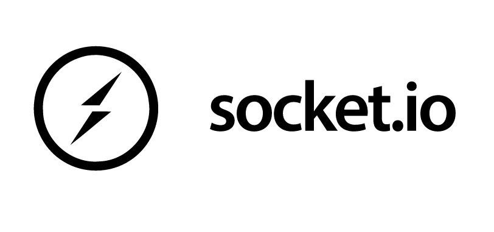

# About

It is an application simulating a social network that will allow you to discuss with you friends securely using end-to-end encryption.

# Technologies used

1. ***Next.js***

    

2. ***Nest.js***

    

3. ***Bootstrap 5***

    

4. ***Socket.io***

    

5. ***Neo4j***

    

6. ***MongoDB***

    

# How to start

### Go inside each file

##### run command:

> npm install

to install all the dependencies

for the api folder add a .env file where you should specify the following environment variables:

># neo4j configuration 
>
>NEO4J_PROTOCOL=neo4j
>
>NEO4J_HOST=***\<YOUR_NEO4J_HOST\>***
>
>NEO4J_USERNAME=***\<YOUR_NEO4J_USERNAME\>***
>
>NEO4J_PASSWORD=***\<YOUR_NEO4J_PASSWORD\>***
>
>NEO4J_PORT=***\<YOUR_NEO4J_PORT\>***
>
>NEO4J_DATABASE=***\<YOUR_NEO4J_DATABASE\>***
>
>NEO4J_ENCRYPTION=ENCRYPTION_OFF
>
>
># jwt secret 
>
>JWT_SECRET= ***\<YOUR_JWT_SECRET\>***
>
># mongodb configuration
>
>MONGODB_HOST=***\<YOUR_MONGODB_HOST\>***
>
>MONGODB_PORT=***\<YOUR_MONGODB_PORT\>***
>
>MONGODB_DATABASE=***\<YOUR_MONGODB_DATABASE>***
>
>#rsa secret
>
>RSA_SECRET=***\<YOUR_RSA_SECRET\>*** (used to generate rsa key pair)

### Then Start Neo4j and Mongo DB servers

### Start API using the command:

> npm run start:dev

### Start Client side using the command:

> npm run dev